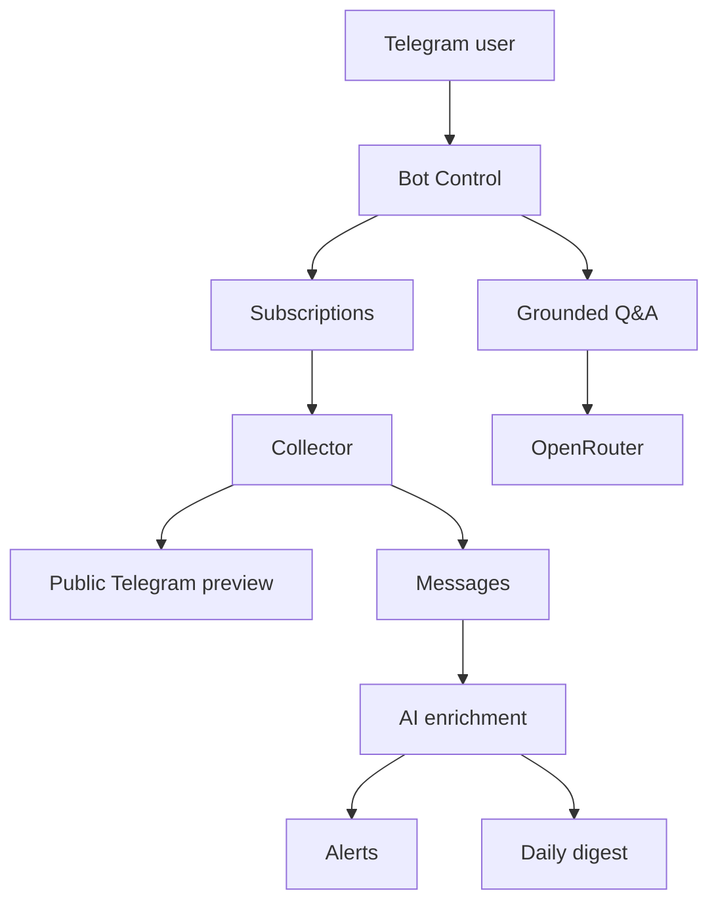

# Architecture

The project is intentionally **n8n-first**: n8n owns scheduling, orchestration, credentials, and persistence. Small JavaScript snippets in Code nodes handle parsing, validation, filtering, and formatting.

## Components

- **Bot Control:** the single Telegram Trigger. It handles commands, subscription CRUD, alerts, digest requests, and Q&A.
- **Collector:** runs every five minutes, fetches `https://t.me/s/<username>`, parses posts, writes new records, and advances a checkpoint only after successful persistence.
- **AI Enrichment & Alerts:** runs every ten minutes, asks the LLM for structured topic and Persian-summary output, computes a 0–100 score, and triggers keyword alerts once per matching post.
- **Daily Digest:** sends the highest-ranked items from the last 24 hours at the configured time.

## Data model

| Table | Stored information |
| --- | --- |
| `subscriptions` | user/channel watchlist and collection checkpoint |
| `messages` | public post metadata, content, LLM topic, summary, and score |
| `alerts` | user keyword alerts |
| `alert_deliveries` | delivery keys used to prevent repeat alerts |

Message deduplication uses `channel_username + message_id`. Alert deduplication uses `alert_id + channel_username + message_id`.

## Ranking and Q&A

The importance score combines freshness (35%), normalized views (25%), and model-provided content importance (40%). Q&A is grounded: n8n applies deterministic time/channel/view filters first, sends bounded context to the model, validates returned source IDs, and outputs source URLs.

See also: [فارسی](README_FA.md).
